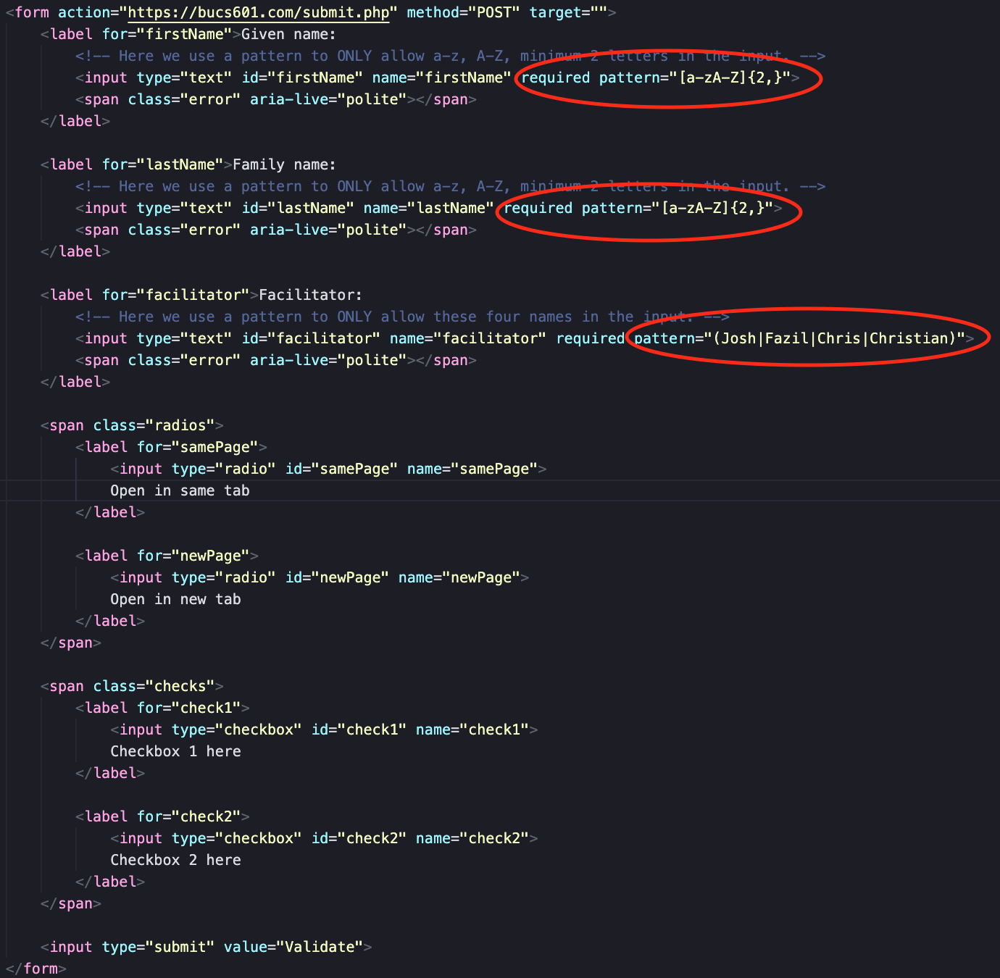
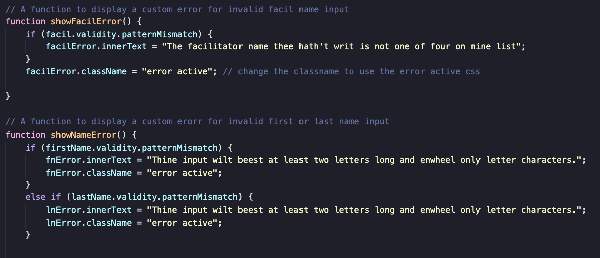
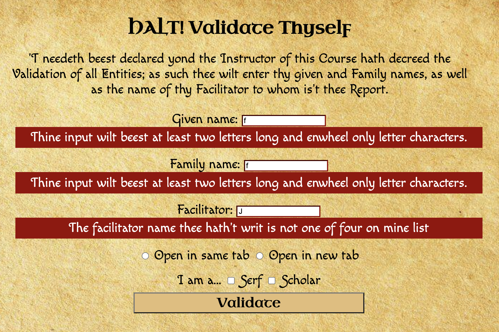
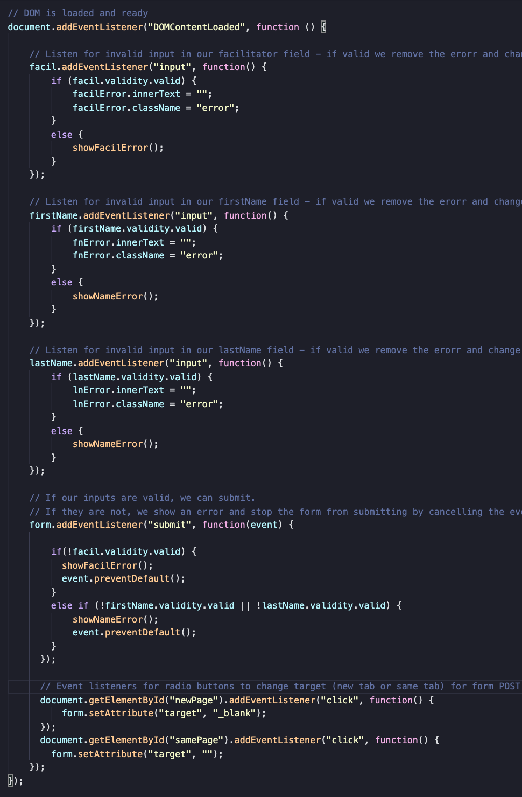

# Shakespearean/Medieval Client-Side Form Validation
A small form validation project created by Jean Shalenkova for CS601 at Boston University, 2021.

## Concept
While working on the error messages for this page, I had a funny thought about what validation like this would look like in medieval times, like a scribe and enforcer for some feudal lord (??? historical accuracy ???) walking around and the enforcer shouting input demands at the poor serfs, so I decided to go for that vibe with this assignment (for fun). Language most definitely not historically accurate - I used [this site](https://funtranslations.com/shakespeare) and made adjustments based on my own judgment.

## The Form
Basically the only important thing about the HTML in this project is this little RegEx pattern I attached to the form inputs. For the student names it specifies that the input must be alpha only and a minimum of two characters, and for the facilitator input I specified the names of the four facilitators in this course. These patterns are basically what makes this whole project tick (I've circled them for easy viewing):

## Error Functions
In this program I have two functions that handle showing the errors on the DOM. In both methods, if the input in the form mismatches the pattern specified in the HTML form, the text in the empty div set aside for the error messages will show an error message. I also change the class name here in order to trigger the CSS for the error message.

** EDIT: I have since edited showNameError() to contain two if statements, rather than an if/else if. Found a bug while trying to generate the following image. **

A form with all incorrect inputs will refuse to submit and will display like so:

## Event Listeners
I have also added event listeners to check if the input is valid. If it is, we change back the error message to empty and the class name back to the inactive div. If not, we show the error message. There are also event listeners for the radio buttons that will change target value of the form, giving users the option to open the submit page in the same tab or in a new tab (by setting target to "_blank").

